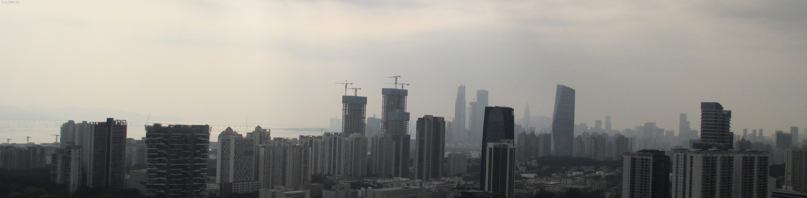

 
# Hi there 👋
## 😉 About Me...
 Bro只是一个初中牲(~~新手ioer~~)owo 
 平常就~~拿AI~~写点代码啥的,就平时会更新点小的服务和程序之类 
 主要有些时候会忙,大概每周节假日会进行更新
## 💻 Now...
 现在主要在开发719WebF,一个共享文件的Flask小服务 
 这个服务已经运行在班里的电教机上 
## ⌨ Language...
 主要用Python进行编写 
## 📷 Photos...
 上面的~~屑~~图是我拍的 ~~(bro喜欢乱拍些东西)~~  
 下图由[蔚蓝档案(国服)官网](https://bluearchive-cn.com/)提供
 
---

<h4 align="center">HZYANG 2026

 

<!--
**HZYANG-2486/HZYANG-2486** is a ✨ _special_ ✨ repository because its `README.md` (this file) appears on your GitHub profile.

Here are some ideas to get you started:

- 🔭 I’m currently working on ...
- 🌱 I’m currently learning ...
- 👯 I’m looking to collaborate on ...
- 🤔 I’m looking for help with ...
- 💬 Ask me about ...
- 📫 How to reach me: ...
- 😄 Pronouns: ...
- ⚡ Fun fact: ...
-->
