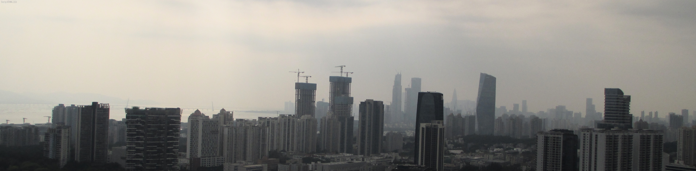

 
# Hi there 👋
## 😉 About Me...
 Bro只是一个初中牲(~~新手ioer~~) 
 平常就~~拿AI~~写点代码啥的,平时会更新点小的服务和程序之类 
 主要有些时候会忙,大概每周节假日会进行更新
## 💻 Now...
<!--加了更多的旋转石墩子😆--> 
 [719WebF](https://github.com/HZYANG-2486/719WebF) 
 [Rin-TOTP](https://github.com/HZYANG-2486/Rin-TOTP) 
 [CICUser](https://github.com/HZYANG-2486/CICUser) 
 [CIPacker-Core](https://github.com/HZYANG-2486/CIPacker-Core) 
 ~~(没人觉得这个很神圣吗）~~
## ⌨ Language...
 ~~主要用Python进行编写~~ 
 我想写什么项目语言就是什么(Python(C#主要是AI写)) 
 ~~另外我懒得写英文(owo)~~ 当我没说 
## 📷 Photos...
 上面的~~屑~~图是我拍的 ~~(bro喜欢乱拍些东西)~~  
 下图由[蔚蓝档案(国服)官网](https://bluearchive-cn.com/)提供
 
---

<h4 align="center">HZYANG 2026

 

<!--
**HZYANG-2486/HZYANG-2486** is a ✨ _special_ ✨ repository because its `README.md` (this file) appears on your GitHub profile.

Here are some ideas to get you started:

- 🔭 I’m currently working on ...
- 🌱 I’m currently learning ...
- 👯 I’m looking to collaborate on ...
- 🤔 I’m looking for help with ...
- 💬 Ask me about ...
- 📫 How to reach me: ...
- 😄 Pronouns: ...
- ⚡ Fun fact: ...
-->
